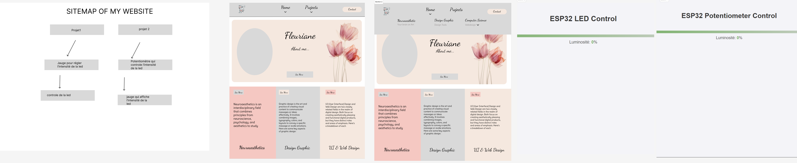

# Contrôle de LED ESP32 et Portfolio de Fleuriane

Ce dépôt contient deux projets web : **Contrôle de LED ESP32** et **Portfolio de Fleuriane**. Ces deux projets utilisent des technologies simples comme HTML, CSS et JavaScript pour des utilisations éducatives et personnelles.

---

## 1. Contrôle de LED ESP32

Cette page web vous permet de contrôler la luminosité d'une LED connectée à un ESP32 via une communication WebSocket. Elle inclut un curseur interactif qui envoie les valeurs de luminosité à l'ESP32 en temps réel.

### Fonctionnalités
- **Communication WebSocket** : Envoie les valeurs de luminosité à l'ESP32 lorsque l'utilisateur ajuste le curseur.
- **Interface dynamique** : Le curseur reflète les changements en temps réel de la luminosité de la LED.
- **Design responsive** : Utilise du CSS pour un affichage optimal sur différents appareils et tailles d'écran.

### Technologies utilisées
- HTML
- CSS
- JavaScript (WebSocket)
- ESP32

### Instructions d'utilisation
1. Remplacez l'adresse IP dans l'URL de connexion WebSocket dans la balise `<script>` par l'adresse IP locale de votre ESP32.
   ```js
   const ws = new WebSocket('ws://<ADRESSE_IP_ESP32>:81');



[
[


